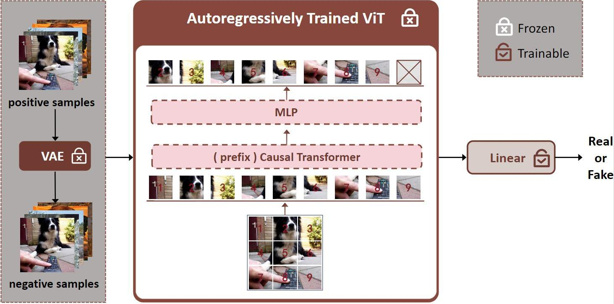

# UAR: Detecting AI-Generated Images Using Only Real Images

The rapid advancement of image generation technologies has led to highly realistic synthetic images, which pose a threat to public trust and security. In real-world scenarios where the generative model behind a fake image is unknown, an effective detector should be capable of identifying out-of-distribution generated images. Current methods typically focus on identifying common artifacts across different generative models. However, these methods often erase a substantial portion of image information, resulting in detection failures even when fakes are visually distinguishable. Our experiments show that autoregressive features are effective for detecting generated images, allowing us to eliminate the reliance on artifacts and preserve the image information. Building on this finding, we propose Universal Autoregressive Detection (UAR), which is trained exclusively on real images. We generate negative samples by reconstructing real images with a variational autoencoder (VAE), rather than using AI-generated images. UAR achieves an average accuracy of 94.48% across 16 generative models, surpassing the state-of-the-art (SoTA) by 2.79%. Additionally, UAR exhibits stable performance under various perturbations.

<div style="text-align: center;">
  
</div>


## Environment Setup

To create the environment and install the necessary dependencies, use the following commands:

```bash
# Create a virtual environment named UAR with Python version 3.10.15
conda create -n UAR python==3.10.15
conda activate UAR

# Install PyTorch with CUDA 11.8 support, along with torchvision and torchaudio
pip install torch==2.1.2 torchvision==0.16.2 torchaudio==2.1.2 --index-url https://download.pytorch.org/whl/cu118

# Install other package
pip install opencv-python
pip install tqdm
pip install transformers==4.47.0

```

## Feature Extraction
We use **AIMv1** to extract image features. The original code can be found at [AIM GitHub repository](https://github.com/apple/ml-aim).  

We made certain modifications to simplify the environment configuration. The modified version is stored in the `UAR/aim` directory.

```bash
cd UAR

# Download the AIM model checkpoint for the backbone weights
wget -O aim_3b_5bimgs_attnprobe_backbone.pth "https://cdn-lfs-us-1.hf.co/repos/1d/1f/1d1f735a636a3cee919e7ab99cb59ab0608b7194e5f6e3569464ab1f9fb28032/8475ce4e4b2b618403d267393f4fac00f614f3bad26b8389506e7762b394260a?response-content-disposition=inline%3B+filename*%3DUTF-8%27%27aim_3b_5bimgs_attnprobe_backbone.pth%3B+filename%3D%22aim_3b_5bimgs_attnprobe_backbone.pth%22%3B&Expires=1736735334&Policy=eyJTdGF0ZW1lbnQiOlt7IkNvbmRpdGlvbiI6eyJEYXRlTGVzc1RoYW4iOnsiQVdTOkVwb2NoVGltZSI6MTczNjczNTMzNH19LCJSZXNvdXJjZSI6Imh0dHBzOi8vY2RuLWxmcy11cy0xLmhmLmNvL3JlcG9zLzFkLzFmLzFkMWY3MzVhNjM2YTNjZWU5MTllN2FiOTljYjU5YWIwNjA4YjcxOTRlNWY2ZTM1Njk0NjRhYjFmOWZiMjgwMzIvODQ3NWNlNGU0YjJiNjE4NDAzZDI2NzM5M2Y0ZmFjMDBmNjE0ZjNiYWQyNmI4Mzg5NTA2ZTc3NjJiMzk0MjYwYT9yZXNwb25zZS1jb250ZW50LWRpc3Bvc2l0aW9uPSoifV19&Signature=cHgf-DbnZoeAEMH9BAhWmlIcn1gpgoxTjsKQ4BOUvole0rP5qIuJZFtYfLM3WUgGBo6PXXG777NVJhmYhzyNi%7EjrCQjkSMGHPi8Vhu0r40%7Em-A02qbQNqw517Wv%7ELkm-9QAvI7y6qPoEB2PIs4AocmVXYkrMGVxQYrmaUfAGiiAcaInXoIuAaJRChuRHZlbtIttpU7femSZUWTL206A15FYvbzJ965o5UtgLWSv6BoOHQvEiuZ1PiH%7ERHV4IbcfmbalLPhgZNL7dmrkDn-bXGHyXuM4buNSd7BNsNB3J2YbHjGbnxrajI4Bi-XVlAJ6uzJdIa8Ppxccp4-zU%7EX8GHw__&Key-Pair-Id=K24J24Z295AEI9"

# Download the second AIM model checkpoint for the head layer weights (best layers)
wget -O aim_3b_5bimgs_attnprobe_head_best_layers.pth "https://cdn-lfs-us-1.hf.co/repos/1d/1f/1d1f735a636a3cee919e7ab99cb59ab0608b7194e5f6e3569464ab1f9fb28032/ad380e16491c30513e7bae84e7b7569272f46b3989e87011ee2574e4bc775586?response-content-disposition=inline%3B+filename*%3DUTF-8%27%27aim_3b_5bimgs_attnprobe_head_best_layers.pth%3B+filename%3D%22aim_3b_5bimgs_attnprobe_head_best_layers.pth%22%3B&Expires=1736735395&Policy=eyJTdGF0ZW1lbnQiOlt7IkNvbmRpdGlvbiI6eyJEYXRlTGVzc1RoYW4iOnsiQVdTOkVwb2NoVGltZSI6MTczNjczNTM5NX19LCJSZXNvdXJjZSI6Imh0dHBzOi8vY2RuLWxmcy11cy0xLmhmLmNvL3JlcG9zLzFkLzFmLzFkMWY3MzVhNjM2YTNjZWU5MTllN2FiOTljYjU5YWIwNjA4YjcxOTRlNWY2ZTM1Njk0NjRhYjFmOWZiMjgwMzIvYWQzODBlMTY0OTFjMzA1MTNlN2JhZTg0ZTdiNzU2OTI3MmY0NmIzOTg5ZTg3MDExZWUyNTc0ZTRiYzc3NTU4Nj9yZXNwb25zZS1jb250ZW50LWRpc3Bvc2l0aW9uPSoifV19&Signature=aoiJnBb9eb8CkZVuAfrj5y3is8crP8F3grLjRXL7hRUq6spO5N0wk3gj2xa%7EJFRF4tKs9vm2a9UJtWQ2qUA9yGAL9xLgom-ZWXNClkDMwR1kndAKxEDdLg9aqtvgGZsXLo5NaCYy3TiU7epsaDvDDiFUhMA8xuJPfSYmZbmDzDg-%7ELvVVjOgAgbFQs4vErSpBkxAX%7EPUV-O86dQ5KmV19iqV6ygZ-DVp6UvPjq42%7ERhgpAkh-Lms0EMqs8CeoWvMud-ydKduyn46X7lBhZnkZRSCdkuisoUX1PVpFOALOC7H0cVmLpzJMYdlcwDgkjE7cnKS4bLaa6IRq5TXHX%7EUaQ__&Key-Pair-Id=K24J24Z295AEI9"

python feature_extract.py --input_path [your_image_root] --output_path [your_npy_root] --backbone_ckpt_path ./aim_3b_5bimgs_attnprobe_backbone.pth --head_ckpt_path ./aim_3b_5bimgs_attnprobe_head_best_layers.pth
```

## Reconstruct Real Images
We use vae in stable diffusion to reconstruct images. You can also use other generative models.
```bash
git lfs install
git clone https://huggingface.co/CompVis/stable-diffusion-v1-4

# you can also use HF-mirror to clone
# git clone https://hf-mirror.com/CompVis/stable-diffusion-v1-4

python reconstruct.py --repo_id ./stable-diffusion-v1-4 --input_dir [your_real_image] --output_dir [your_reconstruct_dir]
```

## Train
We have extracted features of 10,000 real images and their reconstructed images, which are stored in `UAR/data` and can be used directly for training. 
```bash
# Train
python train.py --dataroot ./data --savedir [your_save_path]
```

If you want to train on your own dataset, you can reconstruct real images using `reconstruct.py` and extract features using `feature_extract.py`
```bash
python reconstruct.py --repo_id ./stable-diffusion-v1-4 --input_dir [your_real_image_dir] --output_dir [your_reconstruct_image_dir]
python feature_extract.py --input_path [your_image_root] --output_path [your_npy_root] --backbone_ckpt_path ./aim_3b_5bimgs_attnprobe_backbone.pth --head_ckpt_path ./aim_3b_5bimgs_attnprobe_head_best_layers.pth
```

## Test
The test data can be downloaded from the following [GitHub repository](https://github.com/Ekko-zn/AIGCDetectBenchmark). Baidu Netdisk link: [Download from BaiduNetdisk](https://pan.baidu.com/s/1dZz7suD-X5h54wCC9SyGBA?pwd=l30u#list/path=%2F).

We also provide corresponding `.npy` features in the following links:
- Baidu Netdisk: [Download features from BaiduNetdisk](https://pan.baidu.com/s/1dZz7suD-X5h54wCC9SyGBA?pwd=l30u#list/path=%2F).
- Google Drive: [Download features from Google Drive](<Your_Google_Drive_Link>).

```bash
# Test
python eval.py --dataroot ./test_npy --checkpoint ./checkpoints/AIMClassifier/epoch_0_model.pth
```

## Test Results
### Comparison of Average Accuracy (%) Across Different Generators and Detection Methods

| Generator     | CNNDet | FreDect | Fusing | Gram   | LNP    | LGrad  | DIRE   | UnivFD | PatCra | NPR    | UAR    |
|---------------|--------|---------|--------|--------|--------|--------|--------|--------|--------|--------|--------|
| **ProGAN**    | **100.00** | 99.36  | **100.00** | _99.99_ | 99.95  | 99.83  | 52.75  | 99.81  | **100.00** | 99.79  | 92.34  |
| **StyleGAN**  | 90.17   | 78.02  | 85.20  | 87.05  | 92.64  | 91.08  | 51.31  | 84.93  | 92.77  | **97.85** | _95.94_ |
| **BigGAN**    | 71.17   | 81.97  | 77.40  | 67.33  | 88.43  | 85.62  | 49.70  | 95.08  | _95.80_ | 84.35  | **95.60** |
| **CycleGAN**  | 87.62   | 78.77  | 87.00  | 86.07  | 79.07  | 86.94  | 49.58  | **98.33** | 70.17  | 96.10  | _98.37_ |
| **StarGAN**   | 94.60   | 94.62  | 97.00  | 95.05  | **100.00** | 99.27  | 46.72  | 95.75  | _99.97_ | 99.35  | 97.27  |
| **GauGAN**    | 81.42   | 80.57  | 77.00  | 69.35  | 79.17  | 78.46  | 51.23  | **99.47** | 71.58  | 82.50  | _93.73_ |
| **StyleGAN2** | 86.91   | 66.19  | 83.30  | 87.28  | _93.82_ | 85.32  | 51.72  | 74.96  | 89.55  | **98.52** | 94.50  |
| **WFIR**      | _91.65_ | 50.75  | 66.80  | 86.80  | 50.00  | 55.70  | 53.30  | 86.90  | 85.80  | 51.20  | **97.10** |
| **ADM**       | 60.39   | 63.42  | 49.00  | 58.61  | 83.91  | 67.15  | **98.25** | 66.87  | 82.17  | 86.50  | _90.38_ |
| **Glide**     | 58.07   | 54.13  | 57.20  | 54.50  | 83.50  | 66.11  | 92.42  | 62.46  | 83.79  | **95.47** | _93.74_ |
| **Midjourney**| 51.39   | 45.87  | 52.20  | 50.02  | 69.55  | 65.35  | 89.45  | 56.13  | _90.12_ | **91.51** | 76.89  |
| **SDv1.4**    | 50.57   | 38.79  | 51.00  | 51.70  | 89.33  | 63.02  | 91.24  | 63.66  | 95.38  | _97.07_ | **99.32** |
| **SDv1.5**    | 50.53   | 39.21  | 51.40  | 52.16  | 88.81  | 63.67  | 91.63  | 63.49  | 95.30  | _96.86_ | **99.20** |
| **VQDM**      | 56.46   | 77.80  | 55.10  | 52.86  | 85.03  | 72.99  | 91.90  | 85.31  | 88.91  | _95.31_ | **99.12** |
| **wukong**    | 51.03   | 40.30  | 51.70  | 50.76  | 86.39  | 59.55  | 90.90  | 70.93  | 91.07  | _96.38_ | **99.25** |
| **DALL-E**    | 50.45   | 34.70  | 52.80  | 49.25  | 92.45  | 65.45  | _92.45_ | 50.75  | 96.60  | **98.25** | 89.39  |
| **Average**   | 70.78   | 64.03  | 68.38  | 68.67  | 85.13  | 75.34  | 71.53  | 78.43  | 89.31  | _91.69_ | **94.48** |

---

### Comparison of Average Precision (%) Across Different Generators and Detection Methods

| Generator     | CNNDet | FreDect | Fusing | Gram   | LNP    | LGrad  | DIRE   | UnivFD | PatCra | NPR    | UAR    |
|---------------|--------|---------|--------|--------|--------|--------|--------|--------|--------|--------|--------|
| **ProGAN**    | **100.00** | _99.99_  | **100.00** | **100.00** | **100.00**  | **100.00**  | 58.79  | **100.00** | **100.00** | _99.99_  | 99.97  |
| **StyleGAN**  | _99.83_ | 88.98  | 99.50  | 99.23  | 99.27  | 98.31  | 56.68  | 97.56  | 98.96  | **99.92** | 99.74  |
| **BigGAN**    | 85.99   | 93.62  | 90.70  | 81.79  | 94.54  | 92.93  | 46.91  | 99.27  | _99.42_  | 87.80  | **99.83** |
| **CycleGAN**  | 94.94   | 84.78  | 95.50  | 95.33  | 89.52  | 95.01  | 50.03  | _99.80_  | 85.26  | 98.45  | **99.92** |
| **StarGAN**   | 99.04   | 99.49  | 99.80  | 99.23  | **100.00** | **100.00** | 40.64  | 99.37  | **100.00** | _99.94_  | 99.94  |
| **GauGAN**    | 90.82   | 82.84  | 88.30  | 84.99  | 84.54  | 95.43  | 47.34  | **99.98**  | 81.33  | 85.49  | _99.87_ |
| **StyleGAN2** | 99.48   | 82.54  | 99.60  | 99.11  | _99.70_ | 97.89  | 58.03  | 97.90  | 97.74  | **99.99** | 99.17  |
| **WFIR**      | **99.85** | 55.85  | 93.30  | 95.21  | 42.75  | 57.99  | 59.02  | 96.73  | 95.26  | 67.44  | _97.10_ |
| **ADM**       | 75.67   | 61.77  | 94.10  | 73.11  | 93.37  | 72.95  | **99.99** | 88.52  | 90.91  | 92.57  | _98.83_ |
| **Glide**     | 78.79   | 77.23  | 85.50  | 77.97  | 93.67  | 74.42  | **99.55** | 83.96  | 96.17  | _96.46_ | 99.36  |
| **Midjourney**| 56.92   | 54.68  | 60.90  | 60.71  | 91.22  | 72.99  | 96.59  | 78.29  | 97.15  | **99.79** | 96.17  |
| **SDv1.4**    | 56.73   | 49.95  | 71.90  | 63.80  | 97.14  | 74.01  | 96.16  | 80.46  | 99.28  | _97.56_ | **99.32** |
| **SDv1.5**    | 58.02   | 49.46  | 72.80  | 62.79  | 97.04  | 74.68  | 96.60  | 80.40  | 99.17  | _97.32_ | **99.20** |
| **VQDM**      | 61.77   | 85.79  | 71.70  | 61.81  | 93.71  | 86.28  | 96.23  | 91.18  | 91.68  | _99.76_ | **99.96** |
| **wukong**    | 57.87   | 56.13  | 73.80  | 67.85  | 93.89  | 79.51  | 96.28  | 85.46  | 98.01  | _97.97_ | **99.99** |
| **DALL-E**    | 58.36   | 42.85  | 64.90  | 57.68  | 96.68  | 79.15  | _94.53_ | 78.18  | 99.34  | **99.96** | 99.01  |
| **Average**   | 75.72   | 73.27  | 84.61  | 82.77  | 93.50  | 87.11  | 79.55  | 93.94  | 96.83  | _97.72_ | **99.21** |


